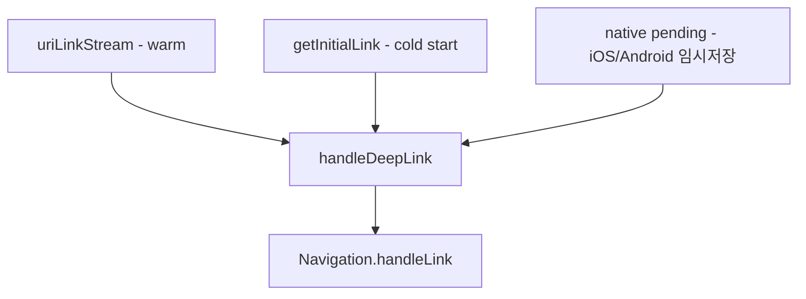

> 시리즈 '웹뷰·네이티브 연동' 2편. 딥링크는 "링크 누르면 앱 열리는 거" 아니냐고 쉽게 보다가 제일 오래 잡은 버그였다. 특히 앱이 완전히 꺼진 상태(cold start)에서 링크로 진입하는 케이스.

딥링크는 상태가 세 가지다. 앱이 떠 있을 때(warm/foreground), 백그라운드에 있을 때, 그리고 **완전히 죽어 있을 때(cold start)**. 앞의 둘은 그럭저럭 굴러갔는데 cold start가 계속 말썽이었다. 이 글은 cold start 검정화면부터 딥링크 파라미터 수집까지 순서대로 정리한 기록이다.

## 1. 딥링크 소스가 여러 개다

먼저 그림부터. 회사 앱에서 딥링크가 들어오는 경로는 하나가 아니다.



`app_links` 플러그인을 붙여서 warm 상태의 스트림과 cold start의 초기 링크를 둘 다 받는다.

```dart
class FirebaseService extends GetxService {
  final AppLinks _appLinks = AppLinks();
  StreamSubscription<Uri>? _linkSub;

  void _initAppLinks() {
    _linkSub = _appLinks.uriLinkStream.listen(
      (uri) => handleDeepLink(uri.toString()),
      onError: (e) => debugPrint('AppLinks stream error: $e'),
    );
  }

  @override
  void onClose() {
    _linkSub?.cancel();
    super.onClose();
  }
}
```

cold start는 스트림이 아니라 `getInitialLink()`로 한 번 당겨온다. 그리고 iOS/Android 네이티브가 임시 저장해둔 pending 딥링크도 폴백으로 확인한다.

```dart
// 네이티브가 임시 저장해둔 딥링크 확인 (iOS/Android 폴백)
if (defaultTargetPlatform == TargetPlatform.iOS ||
    defaultTargetPlatform == TargetPlatform.android) {
  try {
    final pendingUrl = await _pushChannel.invokeMethod<String>('getPendingDeeplink');
    if (pendingUrl != null && pendingUrl.isNotEmpty) {
      handleDeepLink(pendingUrl);
    }
  } catch (_) {
    // MethodChannel 실패 시 무시
  }
}

// app_links의 cold start 딥링크 (myapp://...)
try {
  final initialUri = await _appLinks.getInitialLink();
  if (initialUri != null) handleDeepLink(initialUri.toString());
} catch (_) {}
```

## 2. cold start 검정화면 — race condition

여기서 진짜 문제가 터졌다. Android cold start로 `myapp://invite` 같은 링크를 타고 앱을 켜면 **검정 화면 혹은 빨간 에러 화면**이 떴다. 엥.

원인을 파보니 이랬다. Android cold start 시 intent URI가 Flutter의 `defaultRouteName`으로 들어온다. 그런데 `GetMaterialApp`은 `myapp://invite`라는 이름의 `GetPage`를 찾지 못한다. `PageRedirect.page()`의 null check가 터지고, 그 여파로 `framework.dart`의 `_elements.contains(element)` assertion이 연쇄로 터지면서 화면이 깨졌다.

정리하면 **앱 라우터 트리가 아직 안 떠 있는데 딥링크가 먼저 도착**한 거다. 전형적인 race condition.

해법은 세 가지를 같이 적용했다.

**(1) unknown 라우트 폴백.** 라우터가 모르는 이름이 와도 죽지 않게 `unknownRoute`를 SPLASH로 잡았다.

```dart
GetMaterialApp(
  // ...
  unknownRoute: GetPage(name: Routes.SPLASH.name, page: () => const SplashPage()),
);
```

**(2) pending 큐로 직렬화.** 앱이 라우팅 준비가 안 됐으면 딥링크를 큐에 담아두고, 준비되면 flush한다. `Navigation`에 게이트를 하나 뒀다.

```dart
class Navigation {
  static ({String? href, String? target, String? headerTitle})? _pendingLink;
  static bool _isReady = false;

  static Future<void> handleLink({String? href, String? target, String? headerTitle}) async {
    // 앱이 라우팅 준비 안 됐으면 큐에 보관 (cold start 케이스)
    if (!_isReady) {
      _pendingLink = (href: href, target: target, headerTitle: headerTitle);
      debugPrint('🔗 queued — will flush on markReady()');
      return;
    }
    // ... 실제 라우팅
  }

  static void markReady() {
    if (_isReady) return;
    _isReady = true;

    final pending = _pendingLink;
    if (pending != null) {
      debugPrint('🔗 flushing pending link: ${pending.href}');
      handleLink(href: pending.href, target: pending.target, headerTitle: pending.headerTitle);
    }
  }
}
```

`markReady()`는 `MainController.onReady()`에서 MainPage 트리가 마운트된 뒤에 호출한다. postFrameCallback + 약간의 delay로 트리 마운트 완료를 보장했다.

**(3) 단일 게이트 + dedup 확장.** cold start에서는 `uriLinkStream` + `getInitialLink` + native pending이 **동시에 같은 URL을 줄 수 있다.** 세 소스가 같은 링크를 세 번 라우팅하면 화면이 중복으로 쌓인다. 그래서 모든 진입을 `handleDeepLink` 하나로 모으고, dedup window를 splash→main 전환 시간까지 (1.5초 → 5초) 넓혔다.

```dart
/// 모든 딥링크 진입점은 이 메서드를 거쳐야 한다 (cold/warm 양쪽 중복 방지).
void handleDeepLink(String href) {
  final now = DateTime.now();
  // cold start 시 uriLinkStream + getInitialLink + native pending 이 동시에
  // 같은 URL을 줄 수 있으므로 dedup window 를 전환 시간까지 확장.
  final isDuplicate = _lastHandledLink == href &&
      _lastHandledAt != null &&
      now.difference(_lastHandledAt!).inMilliseconds < 5000;

  if (isDuplicate) {
    debugPrint('🔗 dup skip: $href');
    return;
  }

  _lastHandledLink = href;
  _lastHandledAt = now;
  // ... 실제 라우팅 위임
}
```

> 💡 cold start 딥링크의 핵심은 "라우터가 준비됐는가"와 "같은 링크를 몇 번 받는가" 두 축이다. 큐로 타이밍을 맞추고, dedup으로 중복을 막는다. 이 둘을 따로 보면 계속 샌다.

## 3. 파라미터 수집 — from은 있을 때만

딥링크가 열리는 걸 넘어서, "이 유저가 **어디서** 들어왔나"를 알아야 마케팅/분석이 산다. deeplink URL의 query param 중 `from`을 이벤트에 자동으로 실어보내기로 했다.

처음엔 `from`이 없으면 현재 라우트로 채워 넣었는데, 이러면 딥링크 유입 origin이 아니라 그냥 "지금 화면 이름"이 들어가버렸다. 그래서 규칙을 바꿨다. **deeplink 진입 시 넘어온 `from`이 있을 때만 수집하고, caller가 명시적으로 넣은 값은 그대로 존중.**

```dart
/// deeplink 진입 시 query param의 `from` 값을 자동 주입.
/// caller가 명시적으로 `from`을 넣었다면 그대로 유지.
static Map<String, dynamic> _withFrom(Map<String, dynamic> params) {
  if (params.containsKey('from')) return params;

  final args = Get.arguments;
  if (args is Map) {
    final from = args['from'];
    if (from is String && from.isNotEmpty) {
      return {'from': from, ...params};
    }
  }
  return params;
}
```

이 enrich를 이벤트 발송의 공통 경로(`sendEvents`)에 끼워서, 개별 이벤트 호출부가 신경 쓰지 않아도 자동으로 `from`이 붙게 했다.

```dart
static Future<void> sendEvents(List<AnalyticsEvent> events) async {
  final enriched = events
      .map((e) => AnalyticsEvent(
            provider: e.provider,
            eventName: e.eventName,
            eventData: _withFrom(e.eventData), // ← 여기서 from 주입
          ))
      .toList();
  // ... 발송
}
```

## 4. 딥링크 진입 자체를 이벤트로 남기기

마지막으로 딥링크로 앱이 열린 사실 자체를 이벤트로 남겼다. cold start인지 active 상태인지도 같이. cold start = `isAppActive:false`다.

```dart
/// 딥링크 진입
/// - [url]: 원본 deeplink URL
/// - [isAppActive]: 앱이 active 상태에서 받았는지 여부 (cold start = false)
static Future<void> deeplinkOpen({
  required String url,
  required bool isAppActive,
}) => AnalyticsService.sendPicky(
  AnalyticsEvent(
    provider: AnalyticsProvider.airbridge,
    eventName: 'deeplink_open',
    eventData: {'url': url, 'isAppActive': isAppActive},
  ),
);
```

## 정리

- 딥링크 소스는 warm 스트림 / cold `getInitialLink` / native pending 세 갈래. 전부 **단일 게이트**로 모아라.
- cold start 검정화면은 라우터-딥링크 race다. unknown 라우트 폴백 + pending 큐 + `markReady()` flush로 타이밍을 맞춘다.
- 같은 URL이 여러 소스에서 동시에 오므로 dedup window를 전환 시간까지 넓혀야 중복 진입을 막는다.
- 유입 분석은 `from`을 "있을 때만" 수집. 없다고 현재 라우트로 채우면 origin이 아니라 노이즈가 된다.

